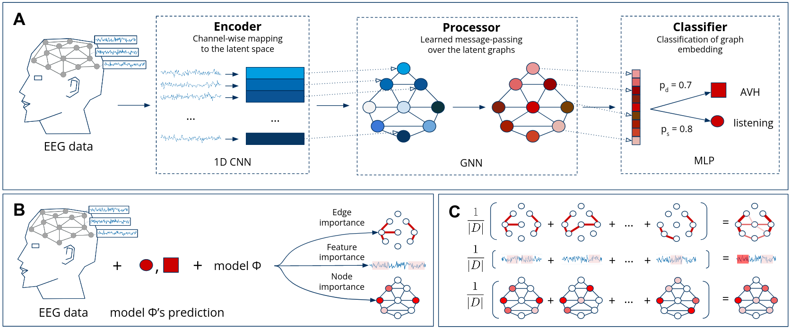

# Investigating Brain Connectivity with Graph Neural Networks and GNNExplainer

Official implementation of:

**Investigating Brain Connectivity with Graph Neural Networks and GNNExplainer**  
Maksim Zhdanov*, Saskia Steinmann, Nico Hoffmann

https://arxiv.org/abs/2206.01930



**Abstract**: Functional connectivity plays an essential role in modern neuroscience. The modality sheds light on the brain's functional and structural aspects, including mechanisms behind multiple pathologies. One such pathology is schizophrenia which is often followed by auditory verbal hallucinations. The latter is commonly studied by observing functional connectivity during speech processing. In this work, we have made a step toward an in-depth examination of functional connectivity during a dichotic listening task via deep learning for three groups of people: schizophrenia patients with and without auditory verbal hallucinations and healthy controls. We propose a graph neural network-based framework within which we represent EEG data as signals in the graph domain. The framework allows one to 1) predict a brain mental disorder based on EEG recording, 2) differentiate the listening state from the resting state for each group and 3) recognize characteristic task-depending connectivity. Experimental results show that the proposed model can differentiate between the above groups with state-of-the-art performance. Besides, it provides a researcher with meaningful information regarding each group's functional connectivity, which we validated on the current domain knowledge. 

**utils**: training (train) and evaluating (test) routines

**model**: contain classifiers to solve the problem (torch.nn.Module classes)

**main**: script to run, it loads dataset and performs training of the model on it.

**baselines**: baseline models (EEGNet and ShallowNet)

* Run the training script:
``` 
python main.py --wandb 1 --key 0 --model GCN --epochs 300 --n_cnn 3 --n_mp 1 --d_latent 32 --d_hidden 64 --kernel_size 31 --p_dropout 0.4 --norm_proc batch
```

